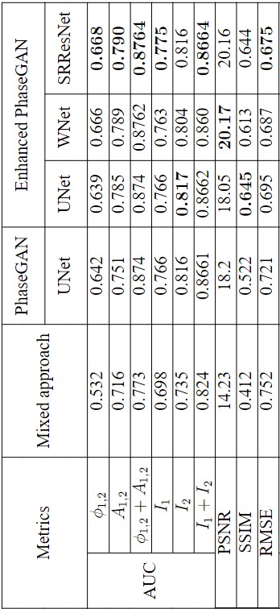

# PhaseGANAI

This project aims to develop an automatic recognizing image system for early detection of breast cancer.

## Conventional imaging technique
Conventional imaging technique is based on the contrast of the attenuation material within an object. It is proven that it can reach great vi­sualization in high X­-ray energy and low radiation dose. However, the image quality is refrained and only valid for weak absorbing objects.  By contrast, current imaging technique, phase contrast imaging, emerges with improved phase sensitivity whose magnitude in soft tissue is 3 orders higher than the attenuation part especially in the presence of tissues with similar density. PCI techniques can enhance the contrast and sensitivity by exploiting the phase contrast. It has seen a large crease in interest and development since 25 years ago. With the use of phase retrieval algorithms together with CT, the complex refractive index distribution in the imaged object can be reconstructed in 3D.
Phase retrieval algorithms are realized base on the linearization of the Fresnel integral (the solutions are not applicable for all conditions (partially followed))
Challenges:
Relatively short distances (paraxial approximation): edge-enhancement regime (assumptions: homogeneity of constituent materials, but not apt to various types of samples).
Far distances: enhanced visible diffraction fringe.

## Phase contrast imaging
Phase contrast imaging concentrates on the phase shift in the phase of X-ray beam that passing through the object to create X-ray images. It mainly depends on a decrease of the X-ray beam’s intensity, which can be directly measured with the assistance of X-ray detector. Its advantage is that it is  more sensitive to density variations in the sample than the conventional imaging (attenuation imaging), yielding an improved soft tissue contrast. Theoretically, phase-contrast X-ray imaging has higher contrast and sensitivity thanconventional absorption imaging. Higher contrast makes the different compositions of anobject more distinguishable.

## Forward Propagation and Phase retrieval algorithm (stated in phase_retrieval.m)
Phase retrieval is the process of algorithmically finding solutions to the phase problem, which can be seved as a kind of nonlinear inverse problem. The major obstacle in the phase retrieval problem is the nonlinear relationship between the intensity (amplitude) and phase of the sample in the image formation process. Although this nonlinear inverse problem can be solved by the iterative phase retrieval algorithms, they rely on computationally intensive iterative operations, and there is no theoretical convergence guarantee, therefore the image degradation will be occurred.


## Steps for image statistical analytics


1. (Image formation) Set the parameters prepared for generating X-ray breast mammography images
command:
```
Step0_DefineParameters_Script.m
```
2. Produce these images using CLB (Clustered Lumpy Background) models
3. Navigate forward propagation to acquire X-ray images on digital detectors
4. Apply phase retrieval algorithms to reconstruct images we actually get
```
Step1_GenerateRealizations.m
```
5. Use statistical observers to analyze image quality and detactability of signals (Gaussian sphere object, represented as some precancerous areas).
```
Step2_CalculateCovofRealizations.m
Step3_template_observer_HO.m
```

# Deep learning algorithms

The area of the signal is overlapped with that of high-density tissues in some phase images, which defers the process of image restoration. As a result, the relationship between the object plane and detector planes cannot be well described. Deep learning techniques have been used to establish a non-linear mapping relationship between the input data and the reconstructed data within the regime of phase-contrast imaging. Here, GAN structure based on the iterative approach is applied to deal with the aforementioned issues. In this part, you can browse the files in 'step04_phaseGAN_part' folder.

## PhaseGAN
The architecture of our neural network, which is called Enhanced phaseGAN in this thesis, is based on the CycleGAN model.


This architecture contains two pairs of generators and discriminators to ensure consistency between two domains. Specifically, the target space, which is wavefield on the object plane, is equipped with one probability distribution, whereas the input image space with another probability distribution. 
Then, the goal of the model is to transform the distribution of the intensity to the wavefield distribution so that the two distributions can be similar.

### 1. Proposed discriminator: PatchGAN
The discriminator structure is modified from the PatchGAN model, aiming to restrict our attention to the image texture with a large variation in local image patches and trying to classify if each of these patches in an image is real or fake.

### 2. Proposed generator: U-Net
The UNet utilizes substitute layers both in its contraction path, where the max-pooling operators are replaced by convolution layers. On the other hand, in extraction path, the deconvolution layers are used to realize a trainable upsampling operation. By doing so, the network can possess more learning capacity.
Skip connection through copy and concatenation is applied among the layers in both contraction and extraction paths to allow the subsequent layers to reuse middle representations, maintaining more information which can lead to better performances.

### 3. Covariance estimation network
The network is concatenated behind each generator in Enhanced phaseGAN, which is called covariance estimation network, to reconstruct the samples from the target distribution. This model has the capability of predicting a full Gaussian covariance matrix for each reconstruction, which permits an efficient likelihood evaluation through capturing the pixel-wise correlations to preserve high-frequency details.

The goal of Enhanced phaseGAN is to learn the mapping between the input and the output. During the whole process, two pairs of generators and discriminators are included. One generator is the detector plane generator, denoted as $G_D$, which implements correction on detector planes. This process aims to make up the wavefield images from the intensity measurements, which is similar to the phase retrieval algorithm but is combined with the regularization technique. The other one is the object plane generator, denoted as $G_O$, which represents the mapping from the object plane to the detector plane. The covariance estimation networks, denoted as $C_O$ and $C_D$ concatenated behind $G_O$ and $G_D$ respectively, are used to optimize the reconstructed results and enhance the signal detectability. As for the discriminators, $D_O$ and $D_D$ represent the object plane discriminator and the detector plane discriminator, respectively, that are both used to discriminate the generated images as real or fake.

# Results

## Criteria of analyzing image quality - ROC curves
The area under the ROC curve (AUC) is a measure of the usefulness of a test, in general, assessing the accuracy of predictions, a greater AUC means a better classifier given by the system, and it can be used to validate the usefulness of the algorithms under different conditions.
The level of contrast becomes higher as the object-to-detector distance increases, indicating that the strength of the noise correlation diminishes as well.

## Deep learning process
# loss curves


## Comments on the following plots
1. The image correlations after applying the iterative approach and neural networks are mitigated in comparison to the estimates without the use of neural networks. This also implies that the lumpy appearance can be partially removed through neural networks.


2. The phaseGAN performs better than the others with image quality in terms of phase components, with the figures and its corresponding table shown in the following.



# Conclusion
1. The Enhanced phaseGAN can capture the relationships between two domains, which are the contact plane and detector plane and outperform the phaseGAN. Besides, it can well enhance the contrast among the backgrounds and signals and thus perform well in detecting signals.
2. Enhanced phaseGAN offers an excellent framework for addressing the nonlinear relationship among phase retrieval algorithms. 


# Difficulties and related future works
## Difficulties
1. As the images become more complicated, the IOs in more complicated detection tasks become unavailable.
2. The knowledge of the statistical properties can only be acquired beforehand in a few clinical practices, resulting in limited evaluation.
## Future works
1. Analyze realistic background images found in clinical applications using other observers (eg. channelized HOs), which may have a stronger correlation with the performance of the human observer than HOs.
2. Another deep generative models, such as variational autoencoders, can be regularised to avoid overfitting, providing a more realistic way to produce images whose latent space has good properties.

# Citation
```
@article{guigay2007mixed,
  title={Mixed transfer function and transport of intensity approach for phase retrieval in the Fresnel region},
  author={Guigay, Jean Pierre and Langer, Max and Boistel, Renaud and Cloetens, Peter},
  journal={Optics letters},
  volume={32},
  number={12},
  pages={1617--1619},
  year={2007},
  publisher={Optical Society of America}
}

@article{langer2008quantitative,
  title={Quantitative comparison of direct phase retrieval algorithms in in-line phase tomography},
  author={Langer, Max and Cloetens, Peter and Guigay, Jean-Pierre and Peyrin, Fran{\c{c}}oise},
  journal={Medical physics},
  volume={35},
  number={10},
  pages={4556--4566},
  year={2008},
  publisher={Wiley Online Library}
}
```


